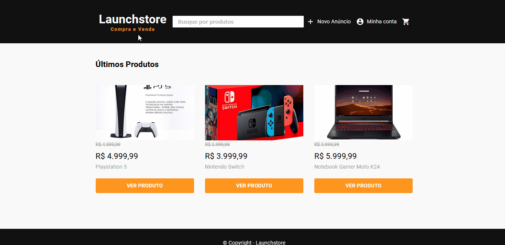
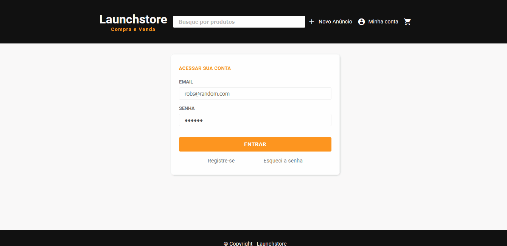

<h1 align="center"><strong>LAUNCHSTORE</br><span style="font-size: 24px; color: #fd951f">Buy and Sell</span></strong></h1>


**WHAT IS THIS PROJECT?**

O QUE É ESTE PROJETO?

:us:
<p align="justify">
Launchstore is an MVC application of an e-commerce. In this project there are two sessions, public and private. The first one is responsible to display the products and create an account, the second one is responsible to add, display, update and remove products, it can also buy and sell.
</p>

<p align="justify">
Launchstore é uma aplicação MVC de uma e-commerce. Neste projeto há duas sessões, uma pública e uma privada. A primeira é responsável por exibir os produtos e criar uma conta, já a segunda é responsável por adicionar, exibir, atualizar e remover produtos, bem como comprar e vender.
</p>

<p>&nbsp;</p>

**:computer: TECHNOLOGIESs**

TECNOLOGIAS

### Frontend:

- [JavaScript][javascript]
- [HTML][html]
- [CSS][css]
- [Nunjucks][njk]
- [Lottie][lottie]

### Backend:

- [Node.js][nodejs]
- [Express][express]
- [PG][pg]
- [PostgreSQL][postgresql]
- [Multer][multer]
- [Faker][faker]
- [BcryptJs][bcryptjs]
- [Nodemailer][nodemailer]

<p>&nbsp;</p>

<h3><strong>PUBLIC SESSION / SESSÃO PÚBLICA</strong></h3>
<h1 align="center">
  
</h1>

<h><strong>PRIVATE SESSION / SESSÃO PRIVADA</strong></h3>

<h1 align="center">
  
</h1>

 <p>&nbsp;</p>

**:rocket: HOW TO ACCESS**

COMO ACESSAR

> COPYING FROM GITHUB / COPIANDO DO GITHUB:

```bash
$ git clone https://github.com/Henryquecimento/launchbase-Launchstore.git
```

> INSTALLING NECESSARY DEPENDENCIES / INSTALANDO DEPENDÊNCIAS NECESSÁRIAS:

```bash
npm install
```

**:gear: DATABASE CONFIGURATION**

CONFIGURAÇÃO DO BANCO DE DADOS

First of all, you must've been installed [PostgreSQL] and [Postbird][postbird] to help you with DB management and other activities.
</br>

Primeiramente, você precisa ter instalado o [PostgreSQL] e o [Postbird][postbird] para lhe auxiliar no gerenciamento do BD e demais atividades.

- <a href="https://www.postgresql.org/download/">POSTGRES</a>
- <a href="https://www.electronjs.org/apps/postbird">POSTBIRD</a>

Disclaimer: </br>
:us:
</br>
My Postgres version is 13, pay attention to yours.
</br>

Minha versão do Postgres é a 13, atenção na versão do seu.

#### WINDOWS OS

1. Open you Powershell as Administrator and browse to the installation folder
   </br>
   Abra o Powershell como administrador e navegue até a pasta de instalação:

```bash
$ cd "C:\Program Files\PostgreSQL\13\bin\"
```

2. Initiate Postgres with the command below
   </br>
   Inicie o Postgres com o comando abaixo:

```bash
$ .\pg_ctl.exe -D "C:\Program Files\PostgreSQL\13\data" start
```

3. After the usage, you can shut it down with the command
   </br>
   Após o uso, você pode desligá-lo com o comando:

```bash
$ .\pg_ctl.exe -D "C:\Program Files\PostgreSQL\13\data" stop
```

#### MAC OS

1. Initiate Postgres with
   </br>
   Iniciar o Postgres com:

```shell
pg_ctl -D /usr/local/var/postgres start
```

2. Shut down Postgres with
   </br>
   Desligar o Postgres com:

```shell
pg_ctl -D /usr/local/var/postgres stop
```

#### LINUX OS

[ Official Documentation to install and use Postgres on Linus OS / Documentação Oficial para instalar e usar Postgres no Linux OS ][postgres-linux]

#### :gear: USING POSTBIRD / USANDO O POSTBIRD

:us:

First, after you turn on Postgres, you can access Postbird and create a database to Launchstore. You can copying the DB's information in the file `launchstoreDB.sql`, at the root of the project, and using the Postbird's Query to add the tables.

Primeiro, após ligar o Postgres, você pode acessar o Postbird e criar um banco de dados para o Launchstore. Você pode estar copiando as informações do BD no arquivo `launchstoreDB.sql`, na raiz do projeto, e utilizando a Query do Postbird para adicionar as tabelas.

<p>&nbsp;</p>

### :gear: IN THE PROJECT / NO PROJETO

You must change the DB configurations to your USER and PASSWORD. Acess the file `src/config/db.js`.
</br>

Você deve modificar as configurações do BD para seu USER e PASSWORD. Acesse o arquivo `src/config/db.js`.

```
module.exports = new Pool({
  user: "YOUR_USER",
  password: "YOUR_PASSWORD",
  host: "localhost",
  port: 5432,
  database: "launchstoreDB",
});
```

<p>&nbsp;</p>


**:computer: EXECUTING THE APPLICATION / EXECUTANDO A APLICAÇÃO**
</br>

1. Access the Launchstore repository </br> Acesse o repositório da Launchstore:

```bash
$ cd launchbase-Launchstore
```

2. In the application, populate with fake date the DB (using Faker.js) </br> Na aplicação, popule com dados falsos o BD (usando o Faker.js):

```bash
$ node seed.js
```

3. Initiate the application (It's working on port 5500 - http://localhost:5500/)</br>
    Inicie a aplicação (está rodando na porta 5500 - http://localhost:5500/):

```bash
$ npm start
```

### :wrench: TO USE THE EMAIL TO RECOVER PASSWORD (DURING THE APPLICATION USAGE) / PARA USAR O EMAIL PARA RECUPERAR A SENHA (DURANTE O USO DA APLICAÇÃO)

</br>
DISCLAIMER: </br>

:us:

You'll need to have an account in [MAILTRAP][mailtrap]. After the account and the email inbox have been created, select the option `nodemailer` to integrate with your application, it'll be provided an authentication with USER and PASSWORD.

After you get your authentication, you can copy and paste in the file `src/lib/mailer.js`, as shown down below:

Você precisará ter uma conta no [MAILTRAP][mailtrap]. Após criar sua conta e criar um inbox de email, selecione a opção `nodemailer` para integração com sua aplicação, será fornecido um objeto com sua auteticação com USER e PASSWORD.

Após conseguir sua autenticação, você pode copiar e colar no arquivo `src/lib/mailer.js`, como mostrado abaixo:

```
module.exports = nodemailer.createTransport({
  host: "smtp.mailtrap.io",
  port: 2525,
  auth: {
    user: "YOUR_USER",
    pass: "YOUR_PASSWORD"
  }
});
```
## :lock: ACCESSING PRIVATE SESSION / ACESSANDO A SESSÃO PRIVADA

:us:

After using `seed.js`, you can take the user email registred in the database. The password is **default** to all users, the **DEFAULT PASSWORD** is `101010` (you can check in the file `seed.js`).


Após utilizar o `seed.js`, você pode pegar o e-mail de um usuário cadastado no banco de dados. A senha é **padrão** para todos os usuários, a **SENHA PADRÃO** é `101010` (você pode checar no arquivo `seed.js`).
## :key: LICENÇA / LICENCE:

This project is under MIT licence, to know more acess [LICENCE][licence].

Este Projeto está sob licença MIT, para saber mais acesse [LICENCE][licence].

<p>&nbsp;</p>

Made with :yellow_heart: by Henryque Rodz :rocket:

[javascript]: https://developer.mozilla.org/pt-BR/docs/Web/JavaScript
[nodejs]: https://nodejs.org/en/
[express]: https://expressjs.com/pt-br/
[html]: https://developer.mozilla.org/pt-BR/docs/Web/HTML
[css]: https://developer.mozilla.org/pt-BR/docs/Web/CSS
[njk]: https://mozilla.github.io/nunjucks/
[postgresql]: https://www.enterprisedb.com/downloads/postgres-postgresql-downloads
[postgres-linux]: https://www.postgresql.org/download/linux/
[pg]: https://github.com/brianc/node-postgres/tree/master/packages/pg
[postbird]: https://www.electronjs.org/apps/postbird
[multer]: https://github.com/expressjs/multer
[lottie]: https://github.com/airbnb/lottie-web
[nodemailer]: https://nodemailer.com/about/
[bcryptjs]: https://www.npmjs.com/package/bcrypt
[faker]: https://github.com/marak/Faker.js/
[mailtrap]: https://mailtrap.io/